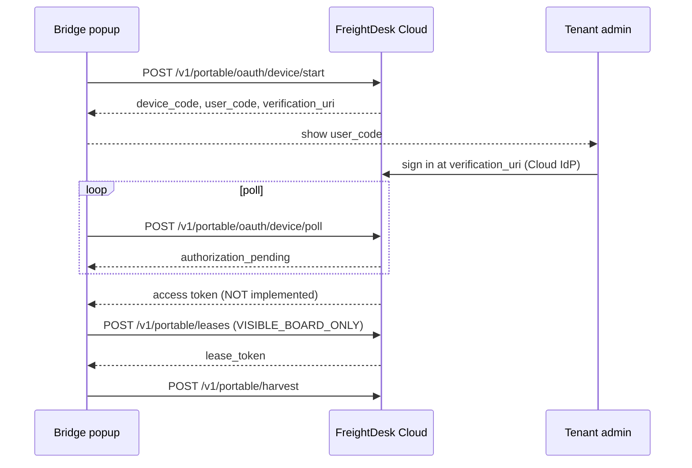

# Cloud lease OAuth v0 — FreightDesk Cloud trust model

Status: **contract rehearsal**. Cloud identity provider is **`NOT_CONFIGURED`**.
Track **B**. Does **not** replace popup Demo sign-in or `DEMO_AGENT`.
**Not LIVE_VALIDATED.**

Audience: Owner + Avery + next engineer. Machine-readable copy:
[config/cloud-lease-oauth-v0.json](../config/cloud-lease-oauth-v0.json).
Implementation: `app/services/cloud_lease_oauth.py`, routes under `/v1/portable/oauth/*`.

Store packaging: [STORE_PACKAGING_V0.md](STORE_PACKAGING_V0.md). Existing demo leases:
[PORTABLE_BRIDGE.md](PORTABLE_BRIDGE.md), `app/services/portable_leases.py`.

## Why this exists

X1 binds Edge to a Windows native host with DPAPI enrollment. That is the wrong shape
for a store product. The portable Bridge already talks HTTPS/HTTP to a FreightDesk
lease API and **must not** grow `nativeMessaging`.

Store-path trust replaces “Load unpacked + PLACEHOLDER” with:

**FreightDesk Cloud identity → capability lease → Extension ↔ Cloud API**

Ascend remains a **provider session the human already opened**. FreightDesk never
receives the Ascend password.

## Layers (keep separate)

| Layer | Who proves it | What it authorizes |
| --- | --- | --- |
| 1. Ascend tab | Human signs into AscendTMS in Chrome/Edge | DOM the content script may observe on `https://ascendtms.com` |
| 2. FreightDesk identity | Device-code or OAuth to **FreightDesk Cloud** | Device/agent principal (`auth_kind` ≠ PLACEHOLDER) |
| 3. Capability lease | `POST /v1/portable/leases` after (2) | `origin=https://ascendtms.com`, `scope=VISIBLE_BOARD_ONLY`, TTL, revoke |
| 4. Harvest | Extension POST with **lease token**, not the IdP token | CANDIDATE board snapshot |
| 5. Writes | ActionPolicy + one-use approval | Private note / status only; assign and money FORBIDDEN |

Cloud policy remains the source of capability. The extension cannot widen scope by
sending extra flags (`production_writes`, `values_included`, `live_validated` stay
rejected). Same gates as today’s demo lease service.

## What already ships (do not break)

| Mode | Route | Mints? | Store-path? |
| --- | --- | --- | --- |
| PLACEHOLDER | `POST /v1/portable/session` + `X-FreightDesk-Portable: 1` | yes, `auth_kind=PLACEHOLDER` | no — demo popup |
| DEMO_AGENT | `POST /v1/agent/session` | yes, `auth_kind=DEMO_AGENT`, `not_oauth=true` | no — Avery localhost |
| Lease | `POST /v1/portable/leases` | lease token | yes, after Cloud identity |
| Harvest | `POST /v1/portable/harvest` | no | yes |
| Revoke | `POST /v1/portable/leases/{id}/revoke` | no | yes |

Popup Demo sign-in and agent Bearer stay the only ways to mint a principal **in this
slice**. OAuth routes are additive.

## Device-code (preferred store auth)

Device-code (RFC 8628 style) avoids the `identity` permission and works the same on
Chrome and Edge. Flow we will wire to Cloud:



### Rehearsal on the demo API (this PR)

| Call | Demo behavior |
| --- | --- |
| `GET /v1/portable/oauth` | Catalog. `cloud_idp=NOT_CONFIGURED`, `mints_session_from_oauth=false` |
| `POST /v1/portable/oauth/device/start` | Issues `device_code` / `user_code`. Hashes `device_code` at rest. **Does not** mint a device session |
| `POST /v1/portable/oauth/device/poll` | `409 authorization_pending` until TTL, then `409 expired_token`. Never returns tokens |
| `POST /v1/portable/oauth/token` | Device-code grant aliases poll. `authorization_code` / `refresh_token` → `409 cloud_idp_not_configured` |
| `POST /v1/portable/oauth/authorize` | `409 cloud_idp_not_configured` (PKCE S256 reserved) |
| `POST /v1/portable/oauth/revoke` | `409 cloud_idp_not_configured` (lease revoke stays on `/v1/portable/leases/{id}/revoke`) |
| `GET /v1/portable/oauth/device/verify` | Explains that completing a user_code will **not** sign you in |

CORS stays on the `/v1/portable` prefix (`chrome-extension://` only). Ascend origin is
still denied. Start/poll/token require `X-FreightDesk-Portable: 1` like Demo sign-in.

Pending device authorizations: max 8, TTL 15 minutes, poll interval 5 seconds. Secrets
are digested with the existing `token_digest`. Audit event
`PORTABLE_OAUTH_DEVICE_STARTED` logs `pending_id` only.

## Authorization-code + PKCE (optional later)

Reserved for a Cloud-hosted HTTPS redirect or `chrome.identity.launchWebAuthFlow`.
v0 store packaging **does not** add the `identity` permission. Prefer device-code so
Edge and Chrome stay one codebase.

When implemented:

- `response_type=code`
- `code_challenge_method=S256` only (no `plain`)
- redirect allowlist: Cloud HTTPS callback and/or `chrome-extension://<id>/…`
- no client secret in the extension (public client)
- no password grant, no client_credentials in the extension

## Token and lease shape (target Cloud)

After a real IdP:

1. Access token: short TTL, hashed at rest, `auth_kind=OAUTH_DEVICE` or `OAUTH_CODE`.
2. Refresh token: held by Cloud or rotating; not `chrome.storage.local` forever.
3. Lease token: **distinct** from the IdP token. Harvest Bearer is the lease.
4. Scope on the lease remains `VISIBLE_BOARD_ONLY` until a later Owner-approved
   write lease (still ActionPolicy-gated).
5. Revoke identity **and** revoke lease are separate. Today’s harvest revoke already
   keeps the last snapshot readable and rejects new posts — keep that.
6. Multi-tenant: Cloud tenant id on the principal; demo store is single-tenant
   `booking-logistics` and is not a retail tenant.

Do not store lease tokens in the content script. That rule already holds.

## Threat model (evolve, don’t weaken)

| Risk | Demo today | Store-path target |
| --- | --- | --- |
| Token theft from `chrome.storage.local` | Localhost API, hashed secrets, short lease TTL, revoke | Device-bound / session storage, rotation, Cloud revoke |
| Malicious Ascend page | Isolated world; content script never holds the lease | Unchanged; store listing keeps host permissions narrow |
| Lease overreach | Scope + write flags rejected in `validate_harvest_snapshot` | Cloud policy engine still source of capability |
| Provider origin calling the API | `https://ascendtms.com` denied as CORS | Keep the deny on Cloud |
| Demo session minting | PLACEHOLDER + portable header | Replace **only** after IdP mint works |
| Agent auth | `DEMO_AGENT` file/env | Tenant OAuth for Avery-class Cloud agents |
| Device-code phishing | n/a | Show the Cloud verification URL; never echo secrets |
| Native host confusion | No `nativeMessaging` | Store zip still has none |

Assign, money, and silent Save Load stay FORBIDDEN regardless of OAuth success.
An IdP token is not a write grant.

## Explicit non-goals

- Do not mint PLACEHOLDER or DEMO_AGENT from `/oauth/*`.
- Do not call live Ascend, Graph, or CarrierView.
- Do not enable Windows native host pairing.
- Do not invent a production Cloud hostname in source (`cloud_api_origin` stays `UNSET`).
- Do not submit the store listing from this PR.

## Next engineering steps

1. Stand up FreightDesk Cloud IdP (tenant users, device-code verification page on HTTPS).
2. On successful poll, mint `auth_kind=OAUTH_DEVICE` using the same hashed-token table
   pattern as `PortableLeaseService.create_device_session`, **without** removing
   PLACEHOLDER until Owner cuts over the popup.
3. Popup: keep **Demo sign-in** in unpacked builds; add **Sign in with FreightDesk**
   only when `GET /v1/portable/oauth` reports `cloud_idp` configured. That UI change
   should wait until after PR #11 (it touches `popup.js` / `background.js`).
4. Replace localhost `host_permissions` using `store_manifest_candidate`.
5. Rotate/revoke Cloud tokens; add refresh. Stronger than `chrome.storage.local`.
6. Multi-tenant agent identity to replace `DEMO_AGENT` for Cloud Avery.
7. HTTPS Cloud deployment (this demo API is loopback-only by middleware).

## Agent curl (rehearsal)

```bash
# Catalog — does not sign you in
curl -sS http://127.0.0.1:8787/v1/portable/oauth

# Device-code rehearsal (no session)
DEVICE=$(curl -sS -X POST http://127.0.0.1:8787/v1/portable/oauth/device/start \
  -H 'X-FreightDesk-Portable: 1' \
  | python -c 'import json,sys; print(json.load(sys.stdin)["device_code"])')

# Poll stays pending / never mints
curl -sS -X POST http://127.0.0.1:8787/v1/portable/oauth/device/poll \
  -H 'X-FreightDesk-Portable: 1' -H 'Content-Type: application/json' \
  -d "{\"device_code\": \"$DEVICE\"}"

# Existing Demo sign-in is unchanged
curl -sS -X POST http://127.0.0.1:8787/v1/portable/session \
  -H 'X-FreightDesk-Portable: 1' -H 'Content-Type: application/json' \
  -d '{"placeholder": true}'
```

See [AGENT_ASCEND_API_V0.md](AGENT_ASCEND_API_V0.md) for Avery Bearer (still not OAuth).
