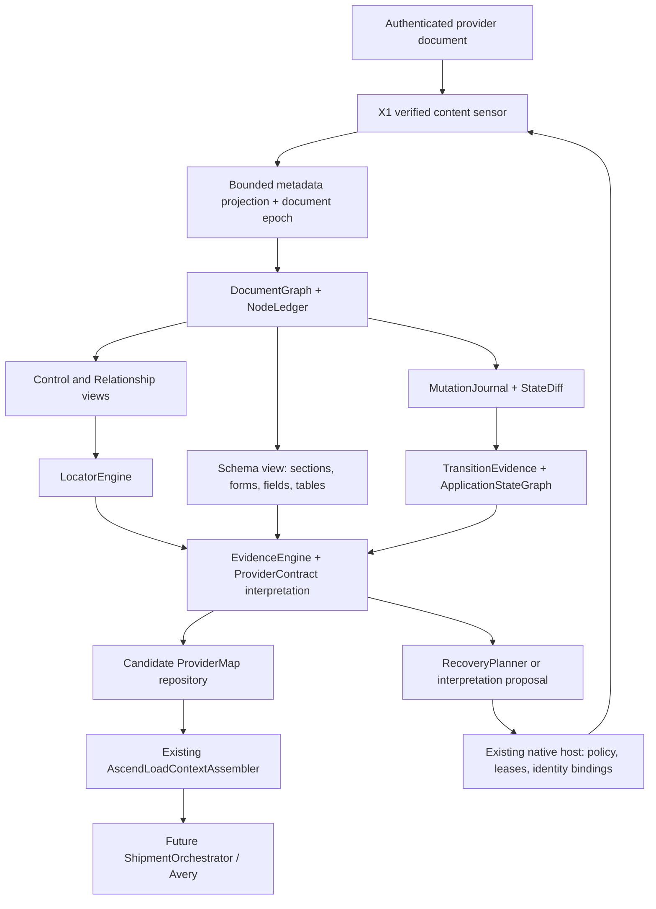

> Current status (2026-09-13): see [the audit repair handoff](WEBBRIDGE_V2_AUDIT_FIXES.md).
> Earlier acceptance/design statements below are historical. V2 is implemented offline with
> audited repairs; live packaging, operational semantics and Phases 3-7 remain deferred.

# WebBridge V2 architecture

WebBridge V2 should be an evidence-preserving interpretation pipeline behind X1, with one document graph and several typed views. It should not become a crawler, a second browser session, or an agent framework. Borrow semantics, node indexing, selector search and mutation bookkeeping; retain FreightDesk's identity, action policy, provenance and business-state reconciliation.

This is a design proposal, not an implementation or new live capability. Source rationale is in [the capability matrix](BROWSER_INTELLIGENCE_CODE_HARVEST.md), [source notes](research/WEBBRIDGE_SOURCES_PLAYWRIGHT_RRWEB_AXE.md) and the other linked research notes. [Page-model types](WEBBRIDGE_V2_PAGE_MODEL.md) and [migration phases](WEBBRIDGE_V2_ROADMAP.md) are part of this design.

## Architecture decision

Use a shared immutable graph per observation epoch, rather than three independently maintained DocumentGraph/ControlGraph/SchemaGraph copies. Controls, forms, fields, tables and sections refer to the same node IDs and evidence records. A persistent ApplicationStateGraph records verified workspace/section transitions across observations; it is separate from physical DOM identity. This prevents pruning, locator recovery and schema extraction from disagreeing about which document they describe.



The last edge is a **typed proposal** to existing policy, never unrestricted execution. X1 remains the only authenticated sensor/executor. There is no Stagehand/Playwright/Browser Use connection, CDP debugger permission, new browser context, remote browser or new native transport. All functions needing DOM access run as fixed packaged content code inside X1's current verified document; pure scoring and graph interpretation may run locally over sanitized DTOs.

## Module responsibilities and interfaces

| Module | Responsibility / inputs → outputs | Borrowed primitive | Deliberately excluded |
| --- | --- | --- | --- |
| X1Boundary | Host grant + actual content handshake + session/presence/document proof → scoped observation request | Existing X1; Playwright context invalidation as reference | New authentication, broad page scripts, policy in model output |
| MetadataProjector | Approved workspace root + permitted vocabulary → values-free semantic node records | Playwright role/label and visibility helpers | Full accessible names containing embedded values, arbitrary text/URLs |
| NodeLedger | Document-local Node handles ↔ epoch-qualified IDs; bounded retention | rrweb Mirror; Stagehand scoped indexes | Cross-document ID reuse, raw handles outside content memory |
| DocumentGraph | Immutable bounded nodes/edges + coverage + generation | Browser Use fused representation; Playwright semantic tree | Flattening away relation-bearing containers |
| ProjectionPasses | Compact derived views while retaining evidence handles | Playwright distiller visitor pipeline | Deleting original evidence because a model view omitted it |
| RelationshipResolver | Explicit ARIA/fragment/provider edges, then bounded structural candidates | Playwright IDREF semantics; Stagehand ancestry indexes; FreightDesk causal rules | Treating adjacency, geometry or role as permission |
| SchemaBuilder | Section/form/field/table structural DTOs and competing mappings | Native label semantics; table occupancy/header models | Guessing unknown labels, padding/truncating provider rows |
| LocatorEngine | Historical signatures + same-scope candidates → ranked typed locator alternatives | Playwright generator; Finder; Scrapling similarity | Whole-page fuzzy healing, first match, automatic activation |
| MutationJournal / StateDiff | Bounded structural mutations + state resampling → added/removed/moved/state changes | rrweb MutationBuffer | Session replay, text/input/style capture, undocumented network inspection |
| TransitionEvidence | Command or owner-navigation event + sequence-fenced before/after graphs → causal candidates | Native composition of above | Temporal proximity alone represented as proven causality |
| ApplicationStateGraph | Verified states, typed navigation edges, outcomes, conditions and evidence | Native provider-state model | URL-only crawling, discovering states by automatic bulk traversal |
| EvidenceEngine | Typed claims + independent evidence families + contradictions → claim-specific status | Preserve existing strict levels; explicit provenance graph | A single confidence number overriding identity or action policy |
| ObservationTransaction | Accepted graph/map + evidence → atomic idempotent append and completion receipt | Existing runtime transaction; Crawlee staged journal as reference | Candidate remaps overwriting accepted exemplars, partial success after persistence failure |
| RecoveryPlanner | Safe failure + budget + current proof → resample/rebind/propose/stop | Playwright cancellation; bounded agent feedback loops as references | Uncertain action retries, revoked-lease recovery, authentication automation |
| ProviderAdapter | Provider vocabulary, entity proof, view semantics, approved actions, field mappings | Existing Ascend contracts refactored | Ascend labels/routes/business assumptions inside generic graph code |

Each stage accepts a cancellation token and budget; each result includes stage, measured counts, coverage and a safe failure predicate. Interfaces are narrow and data-only, for example:

```typescript
// Design pseudotypes; these are not executable production APIs.
interface ObservationPipeline {
  capture(request: ScopedMetadataRequest): Promise<ObservationResult>;
  derive(graph: DocumentGraph, adapter: ProviderAdapter): CandidateProviderMap;
  compare(before: DocumentGraph, after: DocumentGraph): StateDiff;
}
interface LocatorEngine {
  propose(target: LogicalControlSignature, graph: DocumentGraph): Candidate<Locator>[];
  verify(candidate: Locator, boundary: FreshDocumentProof): LocatorVerification;
}
interface RecoveryPlanner {
  plan(failure: SafeFailure, proof: FreshDocumentProof, budget: RecoveryBudget): RecoveryPlan;
}
```

## Three boundaries that must stay distinct

**Physical document identity:** tab/frame/content realm/document generation identifies where a node handle is meaningful. Reload, document replacement and content-module replacement invalidate that handle. Same URL does not imply the same document. Session refresh on an unchanged document need not discard passive observers, but every new grant still requires fresh proof.

**Business workspace identity:** provider evidence establishes entity type and ID independently in each workspace. Tenant identity may remain owner-attested and must be labeled separately. A score, remembered row or successful click does not establish LOAD/N. A child section may inherit identity only from the freshly verified persistent shell enclosing that section.

**Logical control identity:** a versioned relationship/semantic signature may link a control across DOM changes. That linkage is a relocation proposal until reverified in the fresh exact workspace. It is neither a physical node handle nor business identity.

## Acquisition and metadata privacy

Start from the current approved workspace proof. During migration, retain the current provider's identity routine; do not expand the root to the whole page when it fails. Generic discovery examines only bounded semantic root candidates and reports unknown/partial coverage. Build the graph inside the accepted root and any separately verified same-document referenced regions. A portal/dialog outside that root needs fresh exact entity ownership proof: same document or an aria-controls reference alone cannot let another load's region inherit the current identity.

Use a streaming traversal frontier with counts for visited nodes, returned nodes, relationships, depth, elapsed time and payload bytes. Check cancellation while traversing; do not allocate an unbounded querySelectorAll result and check only its final length. Yield between small batches and require the same document/identity epoch at completion. The existing 64-field mapping bound and current grants are not changed by this proposal. New graph budgets need offline measurement and explicit migration review, not a silent increase of live limits.

Mapping may inspect tag, role, static approved label token, structural relation, visibility dimensions, required/editable state and control type. It must not read input value, selected option text, validation message, private note content or arbitrary cell text merely to mask it later. A value-presence requirement, if needed later, belongs in a separately authorized data-reading contract. Text can contain private data even when it appears in an ARIA name or label; classify approved static vocabulary at the source and discard unknown text before graph serialization. Unknown labels remain opaque local nodes and UNKNOWN semantics. Learning their text requires a distinct, owner-reviewed privacy mechanism; the current metadata scope does not authorize it.

This differs from complete accessibility serialization: accessible-name algorithms can incorporate embedded control values. Use a clearly named `MetadataName` projection with source relations, not a claim of complete browser accessible-name equivalence. Do not retain hashes of private values as a workaround.

Current X1 has `all_frames=false` and exact Ascend host permission. V2 models iframe/shadow boundaries now but marks inaccessible frames and closed roots as coverage gaps. Open shadow traversal needs packaged, bounded read-only code and tests; no attachShadow patching or main-world instrumentation is implied. Cross-frame observation is a separate future authorization/design, not part of the initial migration.

## Control and section relationships

Use a registry of generic, typed relationship strategies, with evidence and contradictions exposed:

1. Resolve explicit `aria-controls`, reciprocal `aria-labelledby`, allowed fragment references and provider-approved data-target forms. Validate scope, cardinality and source/target uniqueness.
2. Check selected/expanded/current state and a unique corresponding visible region or heading. A visible control name is evidence about the control, not automatically its content region.
3. Build bounded ancestry/sibling/form-region candidates. Preserve intermediary wrappers and relation paths. The successful Ascend sibling-form rule becomes one reusable structural pattern whose label vocabulary and workspace proof remain in the adapter.
4. Observe newly created, newly visible or newly selected regions within an authorized transition window. Rank direct references above unbound structural changes, but reject equally plausible candidates.
5. Geometry and text similarity may propose a relationship, never independently verify it.

Store rejected candidates and precise predicates. “No relation found,” “competing visible regions,” “scope exit” and “document replaced” are distinct outcomes. Do not continually add one vendor CSS class as a new generic predicate. A new strategy must have provider-independent synthetic cases, counterexamples and source/provenance rationale.

## Forms and tables

Fields are attached to forms and groups through native labels, IDREF edges, fieldset/legend and verified region membership. Group-level canonical units/required state are candidate schema metadata; do not infer freight units or timezone from appearance. A relationship can be observed even while canonical field meaning stays UNKNOWN. Conditional visibility records an observation state; absence in one load does not prove a field is unsupported.

Normalize real HTML tables into logical slots before header assignment, using explicit row-group-aware rowspan/colspan semantics. ARIA grids need a separate projection using provider row/column index/count evidence, with unknown gaps preserved. Keep nested tables separate by nearest owner, distinguish DOM column position from logical and visible column positions, and retain multi-level header ancestry.

Bound expanded logical slots, span dimensions and index ranges **before** allocating a matrix. A small DOM with enormous spans must not exhaust memory. Overlaps, malformed indices and excessive expansion stop with measured predicates; padding, truncation or shifting never repairs an ambiguous schema.

Group possible sticky/header clones by structural header signature and documented owner relation, then require one independently data-bearing candidate. A header match alone is not a data grid. Missing/duplicate critical headers, conflicting indices and competing grids fail closed. Pagination and virtualization are coverage evidence, not inferred completeness. Do not scroll, turn pages or open other loads to complete a table under an observe lease. The current Ascend 33-column contract and VISIBLE_BOARD_ONLY acceptance remain unchanged until a separately validated replacement passes parity and negative tests.

## Locator and confidence model

Exact physical handles are fastest within the same epoch; typed relative role/label/attribute plans provide alternatives after a verified resample. Generate a portfolio and verify uniqueness, root ownership and the target's independent semantic relationships. Penalize ordinals, dynamic identifiers and geometry. Persist candidate structural signatures and permitted locator operands, never raw private strings. Page/model-supplied selectors are not execution inputs.

Adaptive similarity is a ranking tool. Use capped evidence families (role/type, approved naming, ancestor/group relation, stable attributes, neighborhood, geometry) and record each contribution. Repeated variants of one label are correlated evidence, not independent votes. Initial weights and top-candidate margins are hypotheses to calibrate on perturbation fixtures and owner-reviewed examples; no numerical threshold can waive a hard gate. Report ambiguity even when a candidate exceeds a ranking threshold.

Keep immutable accepted exemplars separate from unaccepted candidate signatures. A first/best fuzzy match must never overwrite verified locator history. Promotion creates a new reviewed version with its evidence and preserves earlier exemplars, including failed relocation evidence.

Claims have separate statuses: document proof, workspace identity, observed relationship, canonical meaning, navigation classification, read mapping validation and live capability validation. Candidate field mappings remain CANDIDATE_ONLY. An owner attestation, a provider attribute and an LLM suggestion are different evidence sources. Contradictory identity or action evidence stops immediately; optional fields on a different verified load create CROSS_LOAD_VARIATION unless safety topology changed.

## Mutation and causal state model

The mutation journal coalesces duplicate descendants, moved nodes and removals before serializing structural deltas. Same-document node IDs make most comparisons linear in the changed frontier. Resample computed visibility/selection in candidate regions because CSS/ancestor changes need not yield a direct mutation on the target. Do not use arbitrary time delays as proof of stability; require a bounded quiet window plus stable relevant projections and preserved identity.

For an authorized navigation, record a before-sequence fence, exact control handle, approved navigation contract and command acknowledgement; then observe after-state changes under the same document/workspace binding. Concurrent owner actions, document replacement or unrelated changes lower attribution or stop. Direct target bindings plus the expected independent state change can support a verified edge. New-region timing alone is CORRELATED, not CAUSAL_VERIFIED. A held-out repeat/return observation can strengthen a proposal during separately authorized validation; never repeat actions just to improve confidence during ordinary observation.

ApplicationStateGraph nodes combine provider, tenant provenance, entity kind/ID, verified view/section, document lineage and structural schema version. Distinct loads may share a state template but never share identity. Edges contain preconditions, read/write classification, evidence, permitted executor command, observed outcome and return behavior. URL is an attribute, not the state key. Owner navigation adds observations; it does not authorize a crawler to traverse unvisited edges.

## Recovery hierarchy and agent boundary

| Situation | Permitted planned response | Mandatory stop |
| --- | --- | --- |
| Pure read sampled during transient rendering | Bounded resample of the same approved region | Deadline/budget or identity change |
| Node detached in unchanged document | Resolve alternative, check all proofs again | Ambiguity or no exact scope match |
| Document/content replacement | Invalidate old handles; existing X1 fixed reinjection and fresh proofs where authorized | Lease/presence/session unavailable |
| Optional field on another verified load | Preserve candidate variation and unknown absence | Identity/navigation topology contradiction |
| Unknown semantic label or region | Sanitized proposal/owner observation request | No approved evidence can establish meaning |
| Uncertain navigation outcome | Persist outcome UNKNOWN and require reconciliation | Never automatically repeat a possibly consequential action |
| Missing lease, logout, revoked authority | Stop and clean up job-owned state | No adaptive/agent bypass |

Deterministic → adaptive → semantic → agentic → visual describes proposal sophistication, not escalating authority. Semantic/model layers receive sanitized graph IDs, approved vocabulary, relationships and safe diagnostics only. Output is a typed candidate with evidence references; no executable JavaScript, selectors, URLs, clicks, credentials or operational facts. A verifier must independently reproduce the claim using packaged algorithms and provider contracts. Visual fallback would require separately authorized privacy handling and cannot be assumed available. None of it is implemented by this task.

## Provider adapter and assembler handoff

AscendProviderContract owns exact origin/session markers, LOAD identity signals, section vocabulary, Active Loads view semantics, historical field aliases and owner-reviewed read-only navigation. Core graph code owns generic HTML/ARIA/composed-tree rules, relation types and ambiguity handling. Future DAT/Truckstop/BrokerCarrier adapters require separate source and permission validation; no contract is inferred from the Ascend implementation.

Retain `integrations/ascend/context_assembler.py` and `provider_map_bundle.py`. They already separate candidate maps from trusted field mapping validations and fresh provider value observations. V2 metadata alone must leave operational domains UNKNOWN. Introduce a versioned adapter between ProviderMapV2 and the current map bundle; do not silently reinterpret existing fingerprints or transfer navigation approvals to a changed schema. Canonical shipment mutations remain outside the browser-intelligence pipeline.

Stage graph/map candidates until identity, privacy, coverage and schema checks finish. Append the accepted map, evidence and completion receipt atomically in the existing runtime store, keyed by observation ID and verified payload digest. Coordinator results reference that committed receipt and can be reconciled idempotently after interruption; do not pretend two separate databases commit atomically. Failed persistence must not report success or replay a provider action. Discard unaccepted transient maps while retaining bounded sanitized rejection diagnostics and preserve all consumed-action history.

## Migration and acceptance

The first implementation phase should define invariants and a values-free synthetic corpus, then build DocumentGraph/NodeLedger and relation projections. Run V2 in offline comparison with the current reader, keeping X1 policy/transport untouched. Replace one pure helper at a time only after old accepted cases still pass and counterexamples remain blocked. Current live Ascend success is a baseline fixture/evidence reference, not authorization for new tests.

Acceptance includes scope/budget exhaustion, document replacement, observer continuity, owner presence, independent identity, ambiguous targets, conditional fields, cloned tables, virtualized coverage, hostile labels, value-getter traps, zero writes and cleanup. See [the detailed roadmap](WEBBRIDGE_V2_ROADMAP.md). No production implementation or live execution starts without owner approval.
